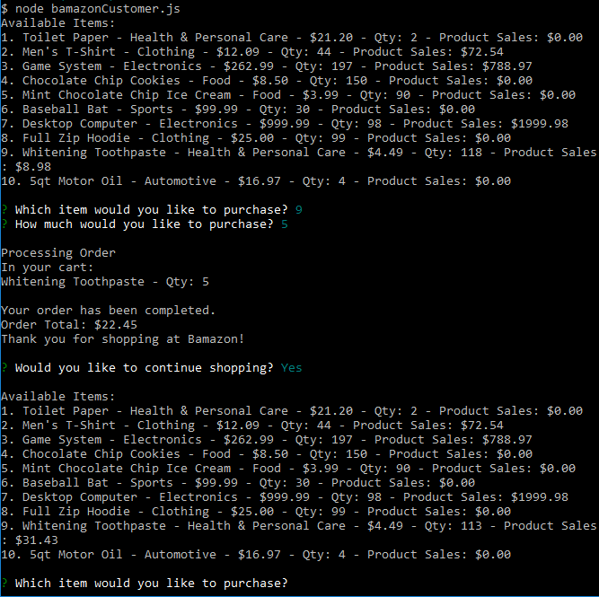
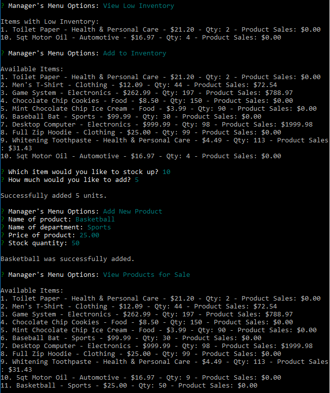
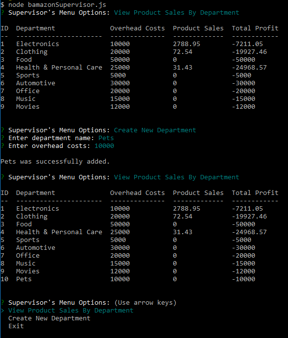

# Bamazon
A command-line store app using npm packages MySQL and Inquirer that lets customers purchase items; managers keep track of items, add stock and add new items; and supervisors view total profits and create departments.

## Table of Contents 

1. [Installation](#installation)
2. [Customer View](#customer)
3. [Manager View](#manager)
4. [Supervisor View](#supervisor)

<a name="installation"></a>
## Installation
First clone or download the source code.
```
git clone https://github.com/jdwong415/Bamazon.git
```
Node.js is needed to run this app. Once that is installed, run the following to download dependenices.
```
npm install
```

<a name="customer"></a>
## Customer View
Run the following in a terminal to view the Customer View.
```
node bamazonCustomer.js
```
The available products will be displayed. Enter the number of the item to be purchased. Next, enter the amount to be purchased. After the order is placed, the product's quantity is checked to see if enough is in stock. If the quantity is not enough, the order is cancelled, otherwise the order is completed. The customer may then continue shopping or exit.

#### bamazonCustomer.js


<a name="manager"></a>
## Manager View
Run the following in a terminal to view the Manager View.
```
node bamazonManager.js
```
A menu with different options will be displayed.
```
View Products for Sale
View Low Inventory
Add to Inventory
Add New Product
```
`View Products for Sale` will display all the products available in the store.

`View Low Inventory` will display all products with a quantity less than five.

`Add to Inventory` allows the manager to increase the stock of a item currently in the store. All of the products in the store is displayed. First the item number of the product to be stocked up is inputed. Next the amount to be added is then entered.

`Add New Product` allows the manager to add a new product not previously available to the store. First the name of the product is entered. Next, the manager chooses from a list of available departments. This is followed by the price of the product and then the quantity to be added.

#### bamazonManager.js


<a name="supervisor"></a>
## Supervisor View
Run the following in a terminal to view the Supervisor View.
```
node bamazonSupervisor.js
```
A menu with different options will be displayed.
```
View Product Sales By Department
Create New Department
```
`View Product Sales By Department` shows the product sales and total profit of each department.

`Create New Department` allows the supervisor to create a new department. First the name of the department is entered. If it already exists, another name will need to be entered. Then, the overhead costs is inputed.

#### bamazonSupervisor.js



