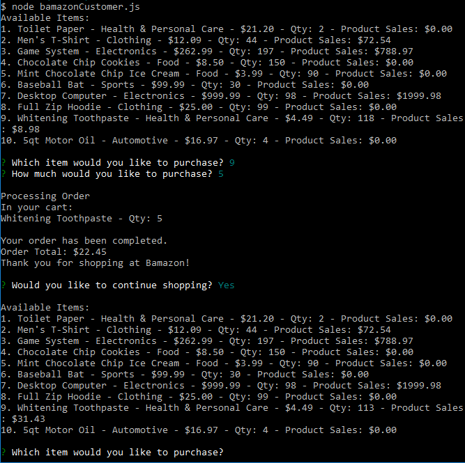
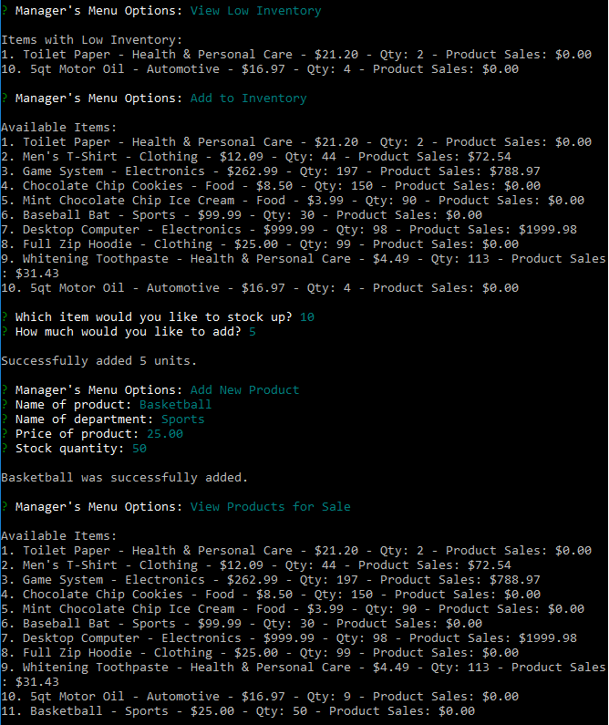
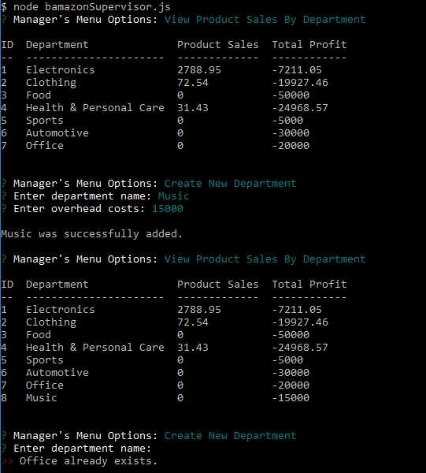

# Bamazon
A command-line store app using npm packages MySQL and Inquirer that lets customers purchase items; managers keep track of items, add stock and add new items; and supervisors view total profits and create departments.

#### bamazonCustomer.js

#### bamazonManager.js

#### bamazonSupervisor.js

